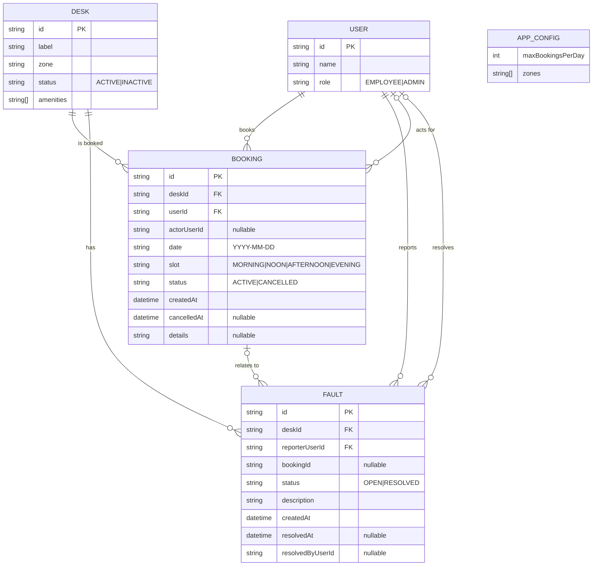

# Backend ER Diagram (Proposed)

This project currently uses an in-browser DB persisted to `localStorage` (`src/api/db.ts`).
This ERD is a proposed backend data model that matches the domain types and behaviors used
by the app.

## Notes / Constraints

- `BOOKING.date` is a calendar day and `BOOKING.slot` is a time-of-day bucket; together they form the "time" uniqueness.
- Enforce uniqueness for ACTIVE bookings by desk/time:
  - unique index: `(deskId, date, slot)` where `status = 'ACTIVE'`.
- Enforce per-user daily limit (config-driven):
  - count of ACTIVE bookings where `(userId, date)` must be `<= APP_CONFIG.maxBookingsPerDay`.
- A `FAULT` may optionally reference the booking that discovered it (`bookingId`).
- `actorUserId` enables "admin books for someone else" auditing.
- `APP_CONFIG` is conceptually a singleton row/document.
